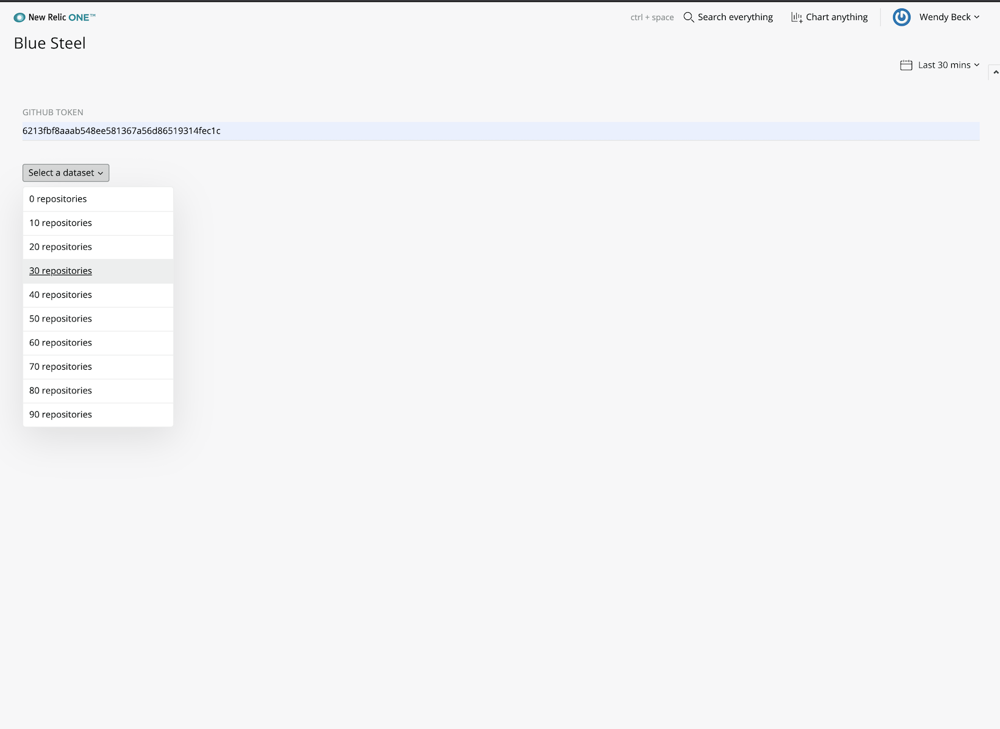
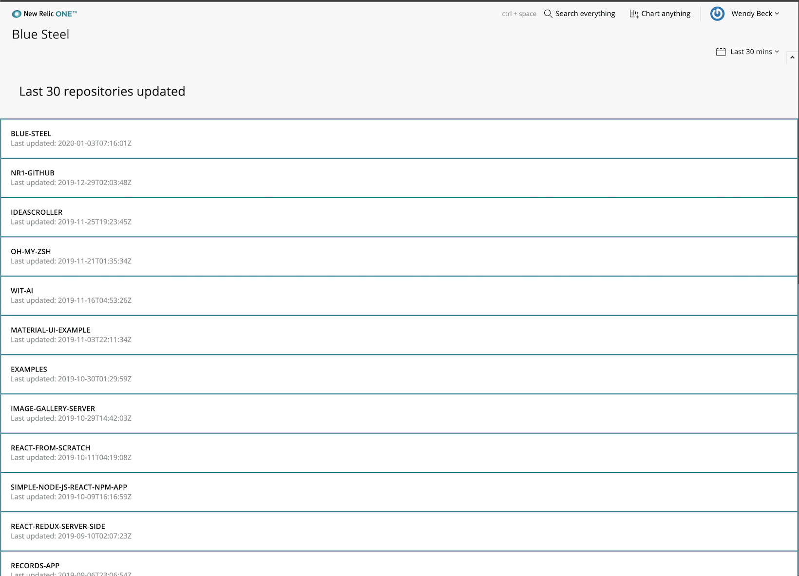

# {{ NERDPACK_NAME }}

> This template includes advice on how to craft a great README for your app. This template is just a starting point: feel free to change or add sections to suit your project. A few sections are standard across all projects. Don't change the text of those sections, except to customize the Explorer's Hub URL and the Contributing email alias. Those sections are: "Open Source License," "Support," "Community," "Issues / Enhancement Requests," and "Contributing."
> 
> If you need advice creating your README, ping @hero in the [#documentation](https://newrelic.slack.com/messages/documentation) channel or contact the Open Source Office. 
> 
> Before you publish, remove all the commments (the block quotes beginning with `>`), then follow the [standard Nerdpack README review process](https://docs.google.com/document/d/1xUg1NnNJriC0mrUE1hqcHcs5dqzyLoSYE25qjwBaWQE/edit). 

 [](https://snyk.io/test/github/newrelic/{{ NERDPACK_NAME }})

## Usage

> Write one or two short paragraphs that describe what your Nerdpack does—and more importantly, why users should care. Avoid too much technical jargon: Your content should be understandable to someone who doesn't have much knowledge of New Relic's technologies. And include links to New Relic docs or other Nerdpacks. 
> 
> For example:

This application analyzes your cloud environment, and figures out where you're wasting money on excess cloud capacity. The application compares the size of your instances to their utilization, and estimates how much you could save by optimizing the size.

> You should also include at least one screenshot. Remove any sensitive data like customer data, NR-only tools, and system information like hostnames (for a full list, see [Docs site security guidelines for images](https://newrelic.jiveon.com/docs/DOC-8362) on Jive).




## Open Source License

This project is distributed under the [Apache 2 license](LICENSE).

## What do you need to make this work?

> Give a complete list of prerequisites for using your app, and include links to other New Relic features when necessary. 
> 
> For example:

Required:

- [New Relic Infrastructure agent(s) installed](https://docs.newrelic.com/docs/agents/manage-apm-agents/installation/install-agent#infra-install) on your cloud computing devices and the related access to [New Relic One](https://newrelic.com/platform).

You'll get the best possible data out of this application if you also:

- [Activate the EC2 integration](https://docs.newrelic.com/docs/integrations/amazon-integrations/get-started/connect-aws-infrastructure) to group by your cloud provider account.
- [Install APM on your applications](https://docs.newrelic.com/docs/agents/manage-apm-agents/installation/install-agent#apm-install) to group by application.

## Getting started

> Include a step-by-step procedure on how to get your app installed and deployed. The clone and deploy steps are similar across all apps. If your app has additional steps required to get started, include them here or in their own section.

1. First, ensure that you have [Git](https://git-scm.com/book/en/v2/Getting-Started-Installing-Git) and [NPM](https://www.npmjs.com/get-npm) installed. If you're unsure whether you have one or both of them installed, run the following command(s) (If you have them installed these commands will return a version number, if not, the commands won't be recognized):
```bash
git --version
npm -v
```
2. Next, install the [NR1 CLI](https://one.newrelic.com/launcher/developer-center.launcher) by going to [this link](https://one.newrelic.com/launcher/developer-center.launcher) and following the instructions (5 minutes or less) to install and setup your New Relic development environment.
3. Next, to clone this repository and run the code locally against your New Relic data, execute the following command:

```bash
nr1 nerdpack:clone -r https://github.com/newrelic/{{ NERDPACK_NAME }}.git
cd {{ NERDPACK_NAME }}
nr1 nerdpack:serve
```

Visit [https://one.newrelic.com/?nerdpacks=local](https://one.newrelic.com/?nerdpacks=local), navigate to the Nerdpack, and :sparkles:

## Deploying this Nerdpack

> Include the necessary steps to deploy your app. Generally, you shouldn't need to change any of these steps. 

Open a command prompt in the nerdpack's directory and run the following commands.

```bash
# If you need to create a new uuid for the account to which you're deploying this Nerdpack, use the following
# nr1 nerdpack:uuid -g [--profile=your_profile_name]
# to see a list of APIkeys / profiles available in your development environment, run nr1 credentials:list
nr1 nerdpack:publish [--profile=your_profile_name]
nr1 nerdpack:deploy [-c [DEV|BETA|STABLE]] [--profile=your_profile_name]
nr1 nerdpack:subscribe [-c [DEV|BETA|STABLE]] [--profile=your_profile_name]
```

Visit [https://one.newrelic.com](https://one.newrelic.com), navigate to the Nerdpack, and :sparkles:

# Support

New Relic has open-sourced this project. This project is provided AS-IS WITHOUT WARRANTY OR DEDICATED SUPPORT. Issues and contributions should be reported to the project here on GitHub.

We encourage you to bring your experiences and questions to the [Explorers Hub](https://discuss.newrelic.com) where our community members collaborate on solutions and new ideas.

## Community

> Work with the Explorer's Hub team to create a tag for your app, then update the link below.

New Relic hosts and moderates an online forum where customers can interact with New Relic employees as well as other customers to get help and share best practices. Like all official New Relic open source projects, there's a related Community topic in the New Relic Explorers Hub. You can find this project's topic/threads here:

https://discuss.newrelic.com/t/{{ NERDPACK_NAME }}
*(Note: URL subject to change before GA)*

## Issues / Enhancement Requests

Issues and enhancement requests can be submitted in the [Issues tab of this repository](../../issues). Please search for and review the existing open issues before submitting a new issue.

# Contributing

> Work with the Open Source Office to update the email alias below.

Contributions are welcome (and if you submit a Enhancement Request, expect to be invited to contribute it yourself :grin:). Please review our [Contributors Guide](CONTRIBUTING.md).

Keep in mind that when you submit your pull request, you'll need to sign the CLA via the click-through using CLA-Assistant. If you'd like to execute our corporate CLA, or if you have any questions, please drop us an email at opensource+{{ NERDPACK_NAME }}@newrelic.com.